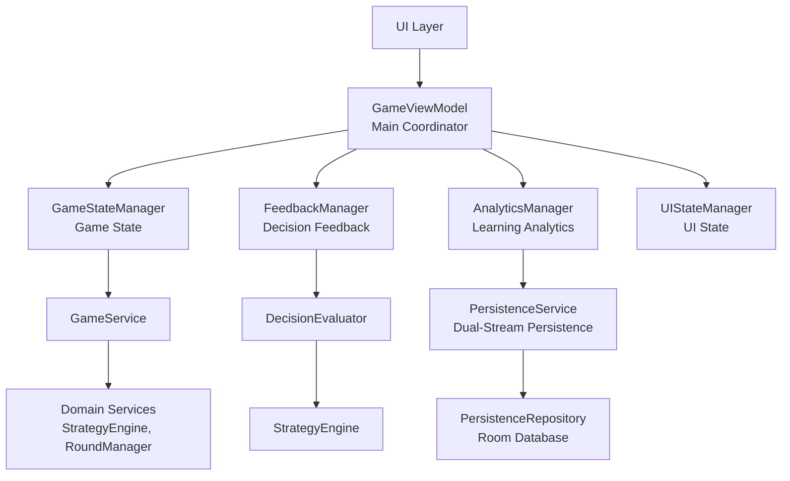
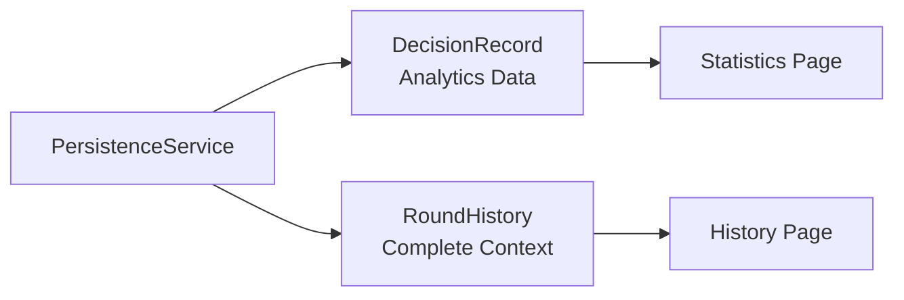

# Blackjack Strategy Trainer

A 21-point strategy trainer implemented with DDD architecture using Kotlin Multiplatform.

## DDD Architectural Decisions

### Bounded Context Design
**Decision**: Single Bounded Context  
**Rationale**: Both subdomains share core concepts (`Hand`, `Card`, `Action`) with the same Ubiquitous Language

### Subdomain Identification
This project contains two subdomains:

#### 1. Game Subdomain - Blackjack Game Logic
Responsible for core game execution
- `Game`, `Player`, `Dealer` - Game state management
- `RoundManager`, `SettlementService` - Game flow control
- `ChipCompositionService` - Chip system

#### 2. Learning Subdomain - Strategy Learning
Responsible for strategy evaluation and learning tracking
- `StrategyEngine` - Basic strategy calculation
- `DecisionEvaluator`, `PersistenceService` - Decision evaluation and learning coordination
- `SessionStats`, `RoundHistory` - Learning analytics

### Shared Core Concepts
Both subdomains share these domain objects:
- `Hand`, `Card`, `Deck` - Basic game concepts
- `Action`, `GameRules` - Game rules and actions
- `DecisionRecord`, `DecisionFeedback` - Cross-subdomain decision records

### Why Not Separate Bounded Contexts?
1. **High Concept Overlap**: `Hand` means the same thing in both game and learning contexts
2. **No Language Ambiguity**: No same-name concepts with different meanings
3. **Small Team Size**: Single team development, no need for language boundaries
4. **Avoid Over-Engineering**: Translation layers and anti-corruption layers would add unnecessary complexity

## Domain Layer Structure

### entities/
- `Game.kt` - Aggregate root managing entire game state and lifecycle
```kotlin
// Domain logic improvement: Moving business logic from Application back to Domain layer
enum class RoundOutcome { WIN, LOSS, PUSH, UNKNOWN }
fun getRoundOutcome(): RoundOutcome  // Round result determination
fun shouldAutoAdvance(): Boolean     // Auto state transition logic
val isGameOver: Boolean             // Game over state
```
- `Player.kt` - Player chip management and betting behavior
- `Dealer.kt` - Dealer state, hole card handling, and automatic hit logic

### valueobjects/
- `Hand.kt` - Hand calculation: soft 17 logic, bust detection, split conditions
- `PlayerHand.kt` - Player hand: bet binding, status tracking, action availability
- `Card.kt` - Playing card basics: suit, rank, blackjack value calculation
- `Deck.kt` - Deck management: shuffle, deal, remaining count
```kotlin
fun dealCard(): Pair<Card, Deck>
fun dealCards(count: Int): Pair<List<Card>, Deck>
val needsShuffle: Boolean = remainingCards < 26
```
- `DecisionRecord.kt` - Decision record: hand, dealer card, player action, correctness
- `DecisionFeedback.kt` - Strategy feedback: error analysis and explanation generation
- `GameRules.kt` - Rule configuration: soft 17, surrender, blackjack payout
- `ChipInSpot.kt` - Chip stacking: denomination and quantity combination
- `AddChipResult.kt` - Bet addition result: success/failure with error message
- `SessionStats.kt` - Session statistics: rule-aware learning progress tracking
- `RoundHistory.kt` - Round history tracking: detailed gameplay records
- `StrategyChartData.kt` - Strategy chart data structure

### services/
- `StrategyEngine.kt` - Basic strategy calculation core
```kotlin
fun getOptimalAction(playerHand: Hand, dealerUpCard: Card, rules: GameRules): Action
// Implements complete strategy logic for splits, soft hands, hard hands, surrender
```
- `RoundManager.kt` - Round flow management: dealing, player action processing, state transitions
- `SettlementService.kt` - Settlement service: win/loss determination and chip calculation
- `ChipCompositionService.kt` - Chip composition optimization: greedy algorithm for minimum chip count
- `PersistenceRepository.kt` - Data persistence interface definition

### enums/
- `Action.kt` - Player actions
```kotlin
enum class Action { HIT, STAND, DOUBLE, SPLIT, SURRENDER }
```
- `GamePhase.kt` - Game phase control
```kotlin
enum class GamePhase { WAITING_FOR_BETS, DEALING, PLAYER_TURN, DEALER_TURN, SETTLEMENT }
```
- `HandStatus.kt` - Hand status
```kotlin
enum class HandStatus { ACTIVE, STANDING, BUSTED, SURRENDERED, WIN, LOSS, PUSH }
```
- `ChipValue.kt` - Chip denominations
```kotlin
enum class ChipValue(val value: Int) { FIVE(5), TEN(10), TWENTY_FIVE(25), ... }
```
- `RoundResult.kt` - Round results
```kotlin
enum class RoundResult { PLAYER_WIN, PLAYER_BLACKJACK, DEALER_WIN, PUSH, SURRENDER }
```

## Application Layer - Use Case Coordination

### Architecture Overview
從 305 行的 God Object 重構為職責分離的管理器架構，保持向後兼容性的同時提升可維護性。



### Core Services

#### `GameViewModel.kt` - 主協調器
統一 API 入口，內部委託給四個專用管理器，解決單一職責原則違反問題。

#### `DecisionEvaluator.kt` - 策略評估服務 ✅ 
連接策略引擎與反饋生成，提供決策正確性評估。
```kotlin
fun evaluateDecision(hand: Hand, dealerCard: Card, action: Action): DecisionFeedback
```

#### `PersistenceService.kt` - 雙流持久化架構
**新增**: 處理數據持久化的核心服務，採用雙流設計：
- **DecisionRecord 流**: 原子決策數據，用於跨遊戲統計分析
- **RoundHistory 流**: 完整回合記錄，用於用戶回放體驗



### Specialized Managers (Internal)

| Manager | 職責 | 核心功能 |
|---------|------|----------|
| **GameStateManager** | 遊戲狀態管理 | `initializeGame`, `startRound`, `executePlayerAction` |
| **FeedbackManager** | 決策反饋評估 | `evaluatePlayerAction`, 決策追蹤 |
| **AnalyticsManager** | 學習分析統計 | `recordPlayerAction`, `sessionStats` |
| **UIStateManager** | UI 狀態通知 | `setError`, `calculateChipComposition` |

### Refactoring Benefits
- **🎯 單一職責**: 每個管理器專注一個領域
- **🔄 向後兼容**: GameViewModel API 保持不變  
- **✅ 可測試性**: 獨立測試各個管理器
- **🔧 可維護性**: 問題定位更精確
- **💾 持久化**: 新增 Room 數據庫支持

## Infrastructure Layer - Technical Implementation

- `InMemoryPersistenceRepository.kt` - In-memory data storage
- `RoomPersistenceRepository.kt` - SQLite database storage with Room
```kotlin
override fun saveDecisionRecord(decision: DecisionRecord)
override fun getRoundHistory(limit: Int): List<RoundHistory>
```

## Presentation Layer - UI Presentation

### components/game/
- `PlayerArea.kt` - Player area: smart switching between betting circle and hand display
- `SmartHandCarousel.kt` - Multi-hand carousel: single hand centered, multi-hand scrollable
- `BettingCircle.kt` - Betting interface: visual chip stacking and clear functionality

### pages/
- `HistoryPage.kt` - Decision history review
- `StatisticsPage.kt` - Learning statistics and progress analysis
- `StrategyPage.kt` - Basic strategy chart display
- `SettingsPage.kt` - Game rules configuration

## Key Implementation Patterns

### Aggregate Root Pattern
```kotlin
// Game controls aggregate consistency + encapsulates business logic
fun dealRound(): Game = RoundManager().dealRound(this)
fun playerAction(action: Action): Game = RoundManager().processPlayerAction(this, action)
fun getRoundOutcome(): RoundOutcome = // Domain logic returns to Domain layer
    if (phase == GamePhase.SETTLEMENT) determineOutcome() else RoundOutcome.UNKNOWN
```

### Application Layer Responsibility Separation Pattern
```kotlin
// GameViewModel delegation pattern: one coordinator + four specialized Managers
class GameViewModel {
    private val gameStateManager = GameStateManager(gameService)     // Game state
    private val feedbackManager = FeedbackManager(decisionEvaluator) // Decision feedback
    private val analyticsManager = AnalyticsManager(learningRecorder) // Learning statistics
    private val uiStateManager = UIStateManager(chipService)         // UI state
    
    // Provides unified API externally, internally delegates to specialized Managers
    val game: Game? get() = gameStateManager.game
    val feedback: DecisionFeedback? get() = feedbackManager.feedback
}
```

### Domain Service Separation
Complex business logic extracted from entities into specialized services:
- Strategy calculation → `StrategyEngine`
- Round management → `RoundManager`
- Settlement processing → `SettlementService`

### Immutable Value Objects
```kotlin
fun addCard(card: Card): Hand = Hand(cards + card)  // Returns new instance
```

### Result Type Pattern
```kotlin
// Simple practical error handling, avoiding over-engineering
sealed class GameStateResult {
    object Success : GameStateResult()
    data class Error(val message: String) : GameStateResult()
}
```

## Development Commands

```bash
# Run desktop version
./gradlew :composeApp:run

# Run tests
./gradlew test

# Build all platforms
./gradlew build

# Android development
./gradlew :composeApp:installDebug
```