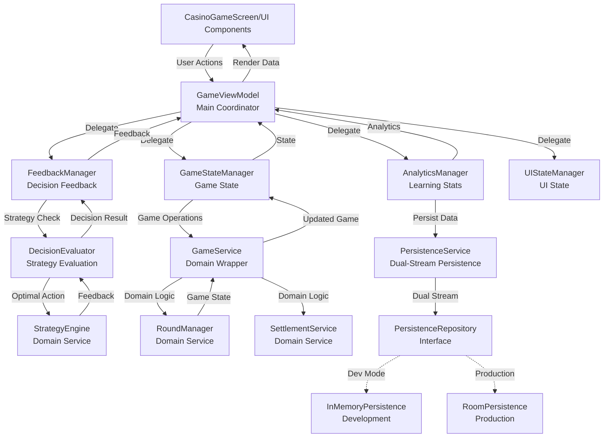
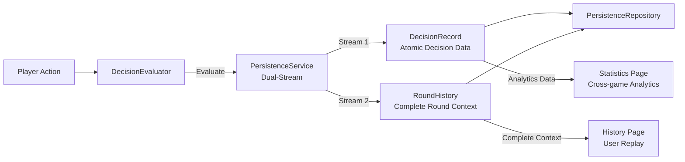
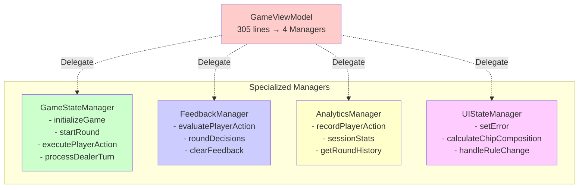

# Application Layer 數據流架構

## 完整的數據流圖表

## 雙流持久化架構

## 管理器職責分離

## 關鍵數據流解釋

### 1. 遊戲操作流程
1. **UI** → **GameViewModel** → **GameStateManager** → **GameService** → **Domain Services**
2. 遊戲狀態更新後，返回路徑相同但反向

### 2. 決策評估流程
1. **Player Action** → **FeedbackManager** → **DecisionEvaluator** → **StrategyEngine**
2. **Strategy Result** → **DecisionFeedback** → **UI Feedback**

### 3. 持久化流程（雙流）
- **決策記錄流**: `DecisionRecord` → 統計分析用途
- **回合歷史流**: `RoundHistory` → 完整回放用途

### 4. 分離的好處
- **單一職責**: 每個管理器專注一個領域
- **可測試性**: 獨立測試各個管理器
- **向後兼容**: GameViewModel API 保持不變
- **維護性**: 問題定位更精確