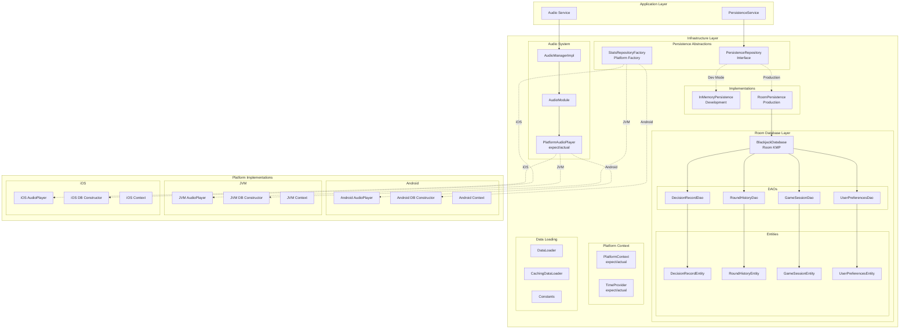
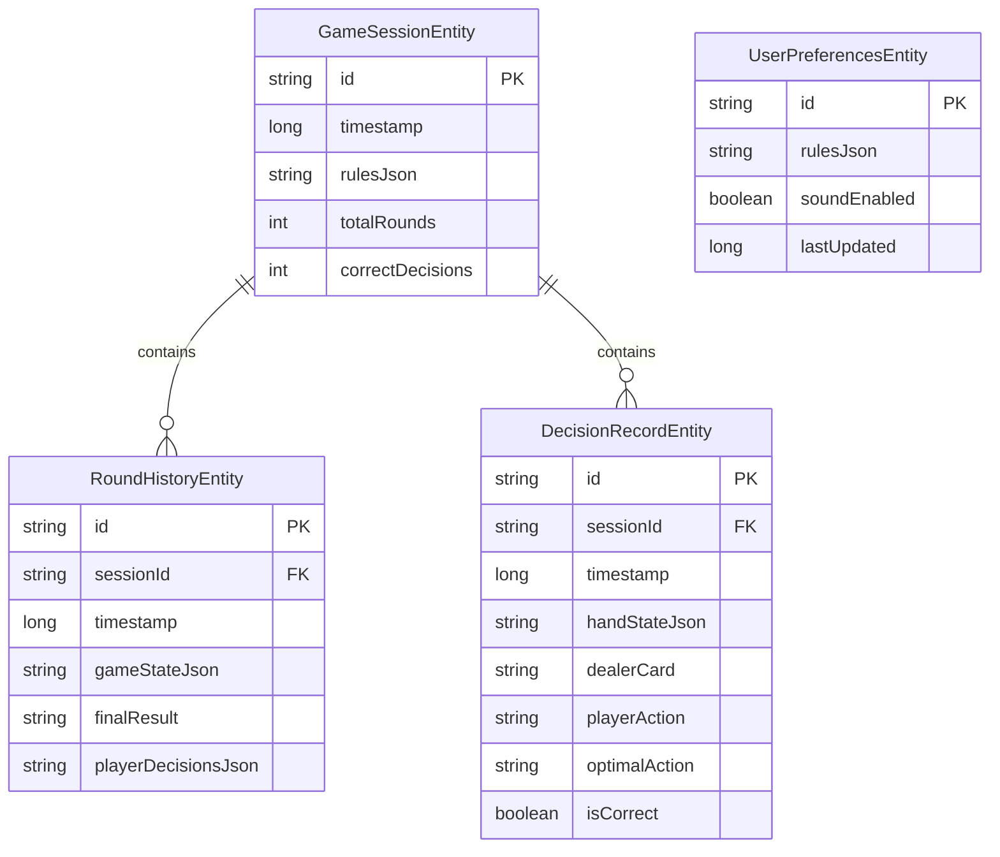
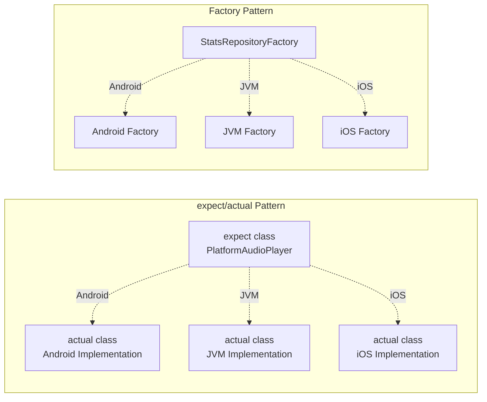

# Infrastructure Layer 架構實踐

## 完整的基礎設施架構



## Room Database 架構詳解

### 數據庫設計


### 平台特定實現策略



## 關鍵設計模式

### 1. Repository Pattern + Factory
```kotlin
// 抽象接口
interface PersistenceRepository {
    suspend fun saveDecisionRecord(decision: DecisionRecord)
    suspend fun getRoundHistory(limit: Int): List<RoundHistory>
    suspend fun getUserPreferences(): UserPreferences?
}

// 平台工廠
object StatsRepositoryFactory {
    fun create(): PersistenceRepository {
        return if (isTestEnvironment()) {
            InMemoryPersistenceRepository()
        } else {
            RoomPersistenceRepository(database)
        }
    }
}
```

### 2. Audio System 模組化
```kotlin
// 跨平台抽象
expect class PlatformAudioPlayer {
    suspend fun initialize()
    suspend fun playSound(resourcePath: String)
    fun release()
}

// 統一管理
object AudioModule {
    fun getAudioManager(): AudioManager {
        return _audioManager ?: createAudioManager().also { _audioManager = it }
    }
}
```

### 3. Room KMP 集成
```kotlin
@Database(
    entities = [
        GameSessionEntity::class,
        RoundHistoryEntity::class, 
        DecisionRecordEntity::class,
        UserPreferencesEntity::class
    ],
    version = 4,
    exportSchema = true
)
@ConstructedBy(BlackjackDatabaseConstructor::class)
abstract class BlackjackDatabase : RoomDatabase() {
    abstract fun decisionRecordDao(): DecisionRecordDao
    abstract fun roundHistoryDao(): RoundHistoryDao
    abstract fun gameSessionDao(): GameSessionDao
    abstract fun userPreferencesDao(): UserPreferencesDao
}
```

## 平台實現差異

| 功能 | Android | JVM Desktop | iOS |
|------|---------|-------------|-----|
| **音訊** | MediaPlayer | JavaFX MediaPlayer | AVAudioPlayer |
| **數據庫** | Room Android | Room Desktop | Room Native |
| **文件路徑** | Context.filesDir | System.getProperty | NSDocumentDirectory |
| **時間** | System.currentTimeMillis | Instant.now | NSDate |

## 測試策略

### 開發環境
- **InMemoryPersistenceRepository**: 快速測試，無持久化
- **本地 Room**: 真實數據庫測試

### 生產環境  
- **RoomPersistenceRepository**: 完整 SQLite 持久化
- **平台優化**: 各平台特定的性能調優

## 關鍵優勢

### 🎯 Clean Architecture 遵循
- **依賴反轉**: Domain 不依賴 Infrastructure
- **抽象穩定**: Repository 接口穩定
- **實現可替換**: 開發/生產環境切換

### 🚀 Kotlin Multiplatform 最佳實踐
- **expect/actual**: 平台特定實現
- **Room KMP**: 統一數據庫 API
- **共享業務邏輯**: 最大化代碼複用

### 🔧 可維護性
- **模組化設計**: 音訊、持久化、平台上下文分離
- **工廠模式**: 統一創建邏輯
- **類型安全**: Room Entity + DAO 保證

### 📊 性能優化
- **連接池**: Room 自動管理
- **批次操作**: DAO 支持批次插入
- **索引策略**: 關鍵查詢字段建立索引